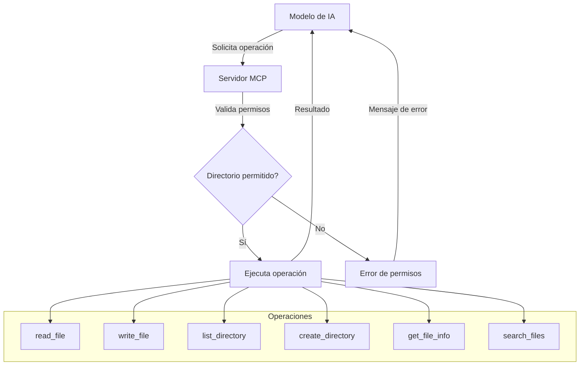

# 📂 Servidor MCP Filesystem

Servidor MCP que proporciona acceso seguro al sistema de archivos para modelos de IA.

## 📋 Descripción

Este servidor implementa un conjunto de herramientas que permiten a modelos de IA como Claude interactuar con el sistema de archivos de manera segura y controlada, limitando el acceso a directorios específicos.

## 🛠️ Herramientas Disponibles

| Herramienta | Descripción | Estado |
|-------------|-------------|--------|
| `read_file` | Lee el contenido de un archivo | ✅ |
| `write_file` | Crea o sobrescribe archivos | ✅ |
| `list_directory` | Lista el contenido de un directorio | ✅ |
| `create_directory` | Crea un nuevo directorio | ✅ |
| `get_file_info` | Obtiene metadatos de archivos | ✅ |
| `list_allowed_directories` | Lista directorios permitidos | ✅ |
| `search_files` | Busca archivos por patrón | ✅ |
| `move_file` | Mueve o renombra archivos | ⏳ |
| `edit_file` | Edita archivos selectivamente | ⏳ |

## 📊 Diagrama de Funcionalidad

## 📚 Documentación Relacionada

- [Roadmap del Servidor](./mcp_filesystem_roadmap.md) - Plan de desarrollo futuro
- [Changelog](./mcp_filesystem_changelog.md) - Historial de cambios
- [Configuración](/docs/mcp/configuracion.md) - Guía de instalación y configuración
- [Implementación](/src/mcp/servers/filesystem/README.md) - Documentación técnica

## 🔧 Instalación y Uso

Para utilizar el servidor, consulta la [documentación de implementación](/src/mcp/servers/filesystem/README.md) que incluye:
- Guía de instalación
- Ejemplos de uso básico
- Integración con FastMCP
- Configuración de directorios permitidos

## 📝 Notas de Seguridad

Este servidor implementa varias características de seguridad:
- Validación de rutas para prevenir acceso fuera de directorios permitidos
- Normalización de rutas para evitar bypass de seguridad
- Control de acceso basado en lista blanca de directorios
- Manejo seguro de rutas en diferentes unidades (Windows)

---

_Última actualización: [Fecha Actual] - [hora]_
