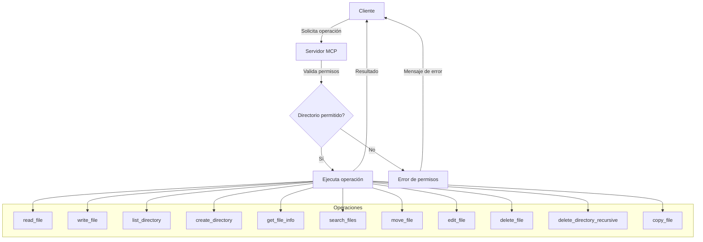

# 📂 Servidor MCP Filesystem

Implementación del servidor MCP que proporciona acceso seguro al sistema de archivos para modelos de IA.

## 📋 Descripción

Este servidor implementa un conjunto de herramientas que permiten a modelos de IA como Claude interactuar con el sistema de archivos de manera segura y controlada, limitando el acceso a directorios específicos.

## 🛠️ Herramientas Disponibles

| Herramienta | Descripción | Estado |
|-------------|-------------|--------|
| `read_file` | Lee el contenido de un archivo | ✅ |
| `write_file` | Crea o sobrescribe archivos | ✅ |
| `list_directory` | Lista el contenido de un directorio | ✅ |
| `create_directory` | Crea un nuevo directorio | ✅ |
| `get_file_info` | Obtiene metadatos de archivos | ✅ |
| `list_allowed_directories` | Lista directorios permitidos | ✅ |
| `search_files` | Busca archivos por patrón | ✅ |
| `move_file` | Mueve o renombra archivos | ✅ |
| `edit_file` | Edita archivos selectivamente | ✅ |
| `delete_file` | Elimina archivos o directorios vacíos | ✅ |
| `delete_directory_recursive` | Elimina directorios y su contenido | ✅ |
| `copy_file` | Copia archivos o directorios | ✅ |

## 🔧 Instalación

El servidor está integrado en el framework MCP y no requiere instalación adicional si ya tienes el proyecto MCP configurado.

## 📋 Uso

### Uso básico

```python
from mcp.servers.filesystem import FilesystemServer

# Inicializar con directorios permitidos
server = FilesystemServer(allowed_directories=['/ruta/permitida'])

# Leer un archivo
content = server.read_file('/ruta/permitida/archivo.txt')

# Escribir en un archivo
server.write_file('/ruta/permitida/nuevo.txt', 'Contenido del archivo')

# Listar directorio
files = server.list_directory('/ruta/permitida')

# Buscar archivos
# - Usando patrones glob
archivos_txt = server.search_files('/ruta/permitida', '*.txt')
# - Usando expresiones regulares
archivos_log = server.search_files('/ruta/permitida', r'\.log$', use_regex=True)
# - Sin búsqueda recursiva
archivos_nivel_superior = server.search_files('/ruta/permitida', '*.py', recursive=False)

# Mover o renombrar archivos
server.move_file('/ruta/permitida/origen.txt', '/ruta/permitida/destino.txt')

# Editar un archivo
edits = [
    {'type': 'replace', 'line_start': 10, 'line_end': 12, 'content': 'Texto de reemplazo'},
    {'type': 'insert', 'line_start': 15, 'content': 'Nueva línea insertada'}
]
server.edit_file('/ruta/permitida/archivo.txt', edits)

# Eliminar un archivo
server.delete_file('/ruta/permitida/archivo_a_eliminar.txt')

# Eliminar un directorio (debe estar vacío)
server.delete_file('/ruta/permitida/directorio_vacio')

# Eliminar un directorio recursivamente con todo su contenido
server.delete_directory_recursive('/ruta/permitida/directorio_con_archivos', confirm=True)

# Copiar un archivo
server.copy_file('/ruta/permitida/origen.txt', '/ruta/permitida/copia.txt')

# Copiar un directorio completo
server.copy_file('/ruta/permitida/directorio_origen', '/ruta/permitida/directorio_destino')
```

### Integración con FastMCP

```python
from mcp.server.fastmcp import FastMCP
from mcp.servers.filesystem import FilesystemServer

# Crear servidor MCP
mcp = FastMCP("Server de Archivos")

# Inicializar servidor de archivos
filesystem = FilesystemServer(allowed_directories=['/ruta/permitida'])

# Registrar herramientas
mcp.add_tool(filesystem.read_file)
mcp.add_tool(filesystem.write_file)
mcp.add_tool(filesystem.list_directory)
mcp.add_tool(filesystem.create_directory)
mcp.add_tool(filesystem.get_file_info)
mcp.add_tool(filesystem.search_files)
mcp.add_tool(filesystem.move_file)
mcp.add_tool(filesystem.edit_file)
mcp.add_tool(filesystem.delete_file)
mcp.add_tool(filesystem.delete_directory_recursive)
mcp.add_tool(filesystem.copy_file)

# Iniciar servidor
mcp.start()
```

## ⚙️ Configuración

Puedes configurar los directorios permitidos mediante un archivo `filesystem_config.json`:

```json
{
  "allowed_directories": [
    "/ruta/permitida/1",
    "/ruta/permitida/2"
  ]
}
```

## 🧪 Pruebas

Para ejecutar las pruebas:

```bash
python -m unittest src.mcp.servers.filesystem.test_filesystem
```

## 📊 Flujo de Funcionamiento



## 📚 Documentación Relacionada

- [Roadmap del Servidor](../../../../docs/mcp/mcp_filesystem_roadmap.md)
- [Changelog](../../../../docs/mcp/mcp_filesystem_changelog.md)

## 📝 Notas de Seguridad

Este servidor implementa varias características de seguridad:
- Validación de rutas para prevenir acceso fuera de directorios permitidos
- Normalización de rutas para evitar bypass de seguridad
- Control de acceso basado en lista blanca de directorios
- Manejo seguro de rutas en diferentes unidades (Windows)

---

_Última actualización: 2025-04-15 - 16:30_
